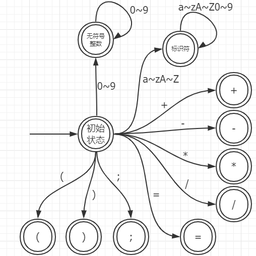

# Miniplc0 C++ 版指导书

## 0. 环境配置

运行 C++ 版本的 Miniplc0 需要以下环境

- 一个支持 C++ 17 的编译器，比如：
  - gcc 8 以上
  - clang 5 以上
  - Visual Studio 2017 以上
- CMake
- Make (如果你用 Visual Studio 的话)

## 3. mini plc0 编译系统

mini plc0 是一门结合了 C0 和 PL0 的语言，当然它大部分灵感还是来源于 C0，后文中 mini 或者 plc0 均指 mini plc0。

这里我们先介绍 mini plc0 编译系统，然后再指导大家如何完成实验。

mini plc0 本身相当简单，但是它依然规定了程序最基本的一些功能：常量/变量定义、四则运算、赋值、输出。

通过本章节的实验，你将：

- ~~重新认识C\+\+~~
- 阅读 mini plc0 文法及其语义规则
- 了解编译器的基本结构
- 了解基于有限状态自动机的词法分析
- 了解递归下降分析以及基于它的代码生成
- 根据章内文档对 mini plc0 编译器的一种实现进行代码补全

实验用的源代码在[这里](https://github.com/BUAA-SE-Compiling/miniplc0-compiler)，可以先 clone 一份然后一边看代码一边阅读指导书。

另外再强调一次：任何抄袭抓到都是判 0 分，相信我们有这个决心，请不要碰这根红线。

### 3.1 编译系统整体结构

整个 mini plc0 编译系统包括一个编译器、一个汇编器、一个反汇编器、一个解释器和一个调试器。

这些工具共同的特点是：一旦发生错误，立即报错并停止运行。

助教会完整实现编译器、汇编器、解释器、反汇编器和调试器发送给学生；但是编译器在发送前，助教会删除部分核心逻辑并留下作为提示的代码注释。实验中，学生的任务是将编译器的逻辑补全，在用其他工具测试补全内容的正确性后提交。

#### 3.1.1 编译器

编译器可以对一份 mini plc0 源代码分别进行词法分析输出 tokens，或者语法分析输出 instructions。

输入语言是 mini plc0 ，输出的是为 mini plc0 编译系统虚拟机设计的指令序列，比如编译下面的 mini plc0 源文件

```
begin
    var a = 1;
    print(a);
end
```

其中一种可能的输出是

```
LIT 1
WRT
```

假设这个输出是 hello.plc0，我们马上还会见到这个文件。

具体的指令集建议先行阅读[miniplc0虚拟机标准](https://vm.buaasecompiling.cn)。

#### 3.1.2 虚拟机工具链

方便起见，把工具链放在一起说明，源代码在[这里](https://github.com/BUAA-SE-Compiling/miniplc0-toolchain)。

注意不同的系统下请使用对应的工具链，都可以在[这里](https://github.com/BUAA-SE-Compiling/miniplc0-toolchain/releases)找到，如果有新版本请及时更新，工具链的输出不作为评分依据。

然后首先看程序的 Usage：

```
A vm implementation for mini plc0.
Usage of miniplc0-windows-amd64.exe:
  -A, --assemble        Assemble a text file to an EPFv1 file.
  -d, --debug           Debug the file.
  -D, --decompile       Decompile without running.
  -h, --help            Show this message.
  -i, --input string    The input file. The default is os.Stdin. (default "-")
  -I, --interprete      Interprete the file.
  -o, --output string   The output file.
  -R, --run             Run the file.
```

这里 `-A` 表示汇编器，`-D` 表示反汇编器，`-d` 表示调试器，`-I` 表示解释器，`-R` 直接运行 EPF 文件。

使用的时候除了指定特定的 flag 以外还需要通过 `-i` 指定输入文件，部分选项还需要用 `-o` 指定输出文件。

汇编器可以将指令序列汇编成为一个 EPF(Executable PCode File) 文件，比如

```
$ cat hello.plc0
LIT 1
WRT
$ ./miniplc0.exe -A -i hello.plc0 -o hello.epf
$ ls
hello.epf*  hello.plc0  miniplc0-darwin-amd64*  miniplc0-linux-amd64*  miniplc0-windows-amd64.exe*
$
```

这里 `LIT 1` 表示入栈一个整数 1，`WRT` 表示输出栈顶的数字，所以这个文件就是我们 miniplc0 编译系统下的 hello world 了。

这里的 hello.epf 是我们虚拟机上的可执行文件，类似 Windows 下的 exe 文件， Linux 下的 ELF 文件，注意 EPF 文件是二进制文件。

然后尝试在虚拟机上直接运行我们刚刚编译的二进制文件。

```
$ ./miniplc0-windows-amd64.exe -R -i hello.epf
1
$
```

可以看到正常输出了 1。

我们也可以用解释器直接解释执行 plc0 文本文件，比如：

```
$ ./miniplc0-windows-amd64.exe -I -i hello.plc0
1
$
```

可以看到同样正常输出了 1。

如果我们想了解一个 EPF 文件的实际指令，可以使用反汇编器，比如：

```
$ ./miniplc0-windows-amd64.exe -D -i hello.epf -o -
LIT 1
WRT
$
```

可以看到反编译出了我们之前的 hello.plc0，注意这里 `-` 表示 stdout。

最后我们可以用调试器来单步执行，比如：

```
$ ./miniplc0-windows-amd64.exe -d -i hello.epf
Simple miniplc0 debugger.
You can use the abbreviation of a command.
[H]elp -- Show this message.
[N]ext -- Run a single instruction.
[L]ist n -- List n instructions.
[S]tack n -- Show n stack elemets.
[I]formation -- Show current information.
[Q]uit -- Quit the debugger.
>L
|       LIT 1   | <-- ip
|       WRT     | 1
>S
|       0       | <-- sp
>N
Next instruction: WRT
>S
|       0       | <-- sp
|       1       | 0
>L
|       LIT 1   | 0
|       WRT     | <-- ip
>N
1
Next instruction: ILL
>S
|       1       | <-- sp
>Q
$
```

可以看到利用调试器我们可以很方便的查看栈的变化。

如果上述工具链出现了任何问题，请及时联系助教。

### 3.2 mini plc0 文法与约束

mini plc0 的完整文法如下，如果存在理解困难，请参阅附录[EBNF](#ebnf)。

```
<字母> ::=
     'a'|'b'|'c'|'d'|'e'|'f'|'g'|'h'|'i'|'j'|'k'|'l'|'m'|'n'|'o'|'p'|'q'|'r'|'s'|'t'|'u'|'v'|'w'|'x'|'y'|'z'
    |'A'|'B'|'C'|'D'|'E'|'F'|'G'|'H'|'I'|'J'|'K'|'L'|'M'|'N'|'O'|'P'|'Q'|'R'|'S'|'T'|'U'|'V'|'W'|'X'|'Y'|'Z'
<数字> ::= '0'|'1'|'2'|'3'|'4'|'5'|'6'|'7'|'8'|'9'
<符号> ::= '+'|'-'

<无符号整数> ::= <数字>{<数字>}
<标识符> ::= <字母>{<字母>|<数字>}

<关键字> ::= 'begin' | 'end' | 'const' | 'var' | 'print'

<程序> ::= <空白序列>'begin'<空白序列><主过程>'end'<空白序列>
<主过程> ::= <常量声明><变量声明><语句序列>

<常量声明> ::= {<常量声明语句>}
<常量声明语句> ::= 'const'<空白序列><标识符><空白序列>'='<空白序列><常表达式>';'<空白序列>
<常表达式> ::= [<符号>]<无符号整数><空白序列>

<变量声明> ::= {<变量声明语句>}
<变量声明语句> ::= 'var'<空白序列><标识符><空白序列>['='<空白序列><表达式>]';'<空白序列>

<语句序列> ::= {<语句>}
<语句> ::= <赋值语句>|<输出语句>|<空语句>
<赋值语句> ::= <标识符><空白序列>'='<空白序列><表达式>';'<空白序列>
<输出语句> ::= 'print'<空白序列>'('<空白序列><表达式>')'<空白序列>';'<空白序列>
<空语句> ::= ';'<空白序列>

<表达式> ::= <项>{<加法型运算符><空白序列><项>}
<项> ::= <因子>{<乘法型运算符><空白序列><因子>}
<因子> ::= [<符号>]( <标识符> | <无符号整数> | '('<空白序列><表达式>')' )<空白序列>

<加法型运算符> ::= '+'|'-'
<乘法型运算符> ::= '*'|'/'

<空白序列> ::= <空白符>{<空白符>}
<空白符> ::= ' ' | <LF> | <CR> | <HT>
<LF> 是 ASCII值等于0x0A的字符(换行符)
<CR> 是 ASCII值等于0x0D的字符(回车符)
<HT> 是 ASCII值等于0x09的字符(水平制表符)
```

参考翻译表

|    中文名    |             英文名             |    中文名    |         英文名          |  中文名  |        英文名         |
| :----------: | :----------------------------: | :----------: | :---------------------: | :------: | :-------------------: |
|     数字     |             digit              |     字母     |     alpha / letter      |   符号   |         sign          |
|  无符号整数  |    unsigned integer literal    |    标识符    |       identifier        |  关键字  |        keyword        |
|     程序     |            program             |    主过程    |      main process       | 常量声明 | constant declarations |
| 常量声明语句 | constant declaration statement |   常表达式   |   constant expression   | 变量声明 | variable declarations |
| 变量声明语句 | variable declaration statement |   语句序列   |   statement sequence    |   语句   |       statement       |
|   赋值语句   |     assignment expression      |   输出语句   |    output statement     |  空语句  |    empty statement    |
|    表达式    |           expression           |      项      |          term           |   因子   |        factor         |
| 加法型运算符 |       additive operator        | 乘法型运算符 | multiplicative operator |          |                       |

语义规则：

- 不能重定义：同一个标识符，不能被重复声明
- 不能使用没有声明过的标识符
- 不能给常量赋值：被声明为常量的标识符，不能出现在赋值语句的左侧
- 不能使用未初始化的变量：不能参与表达式的运算，也不能出现在赋值语句的右侧
- 无符号整数字面量的值必须在值域$\left[0, 2^{31}-1 \right]$以内


### 3.3 词法分析

从这里开始我们推荐配合 tokenizer/tokenizer.h 和 tokenizer/tokenizer.cpp 阅读。

#### 3.3.1 token

直接查看 tokenizer/token.h 中定义的 miniplc0 的 token 种类：

```
// tokenizer/token.h

namespace miniplc0 {

	enum TokenType {
		NULL_TOKEN, // 仅仅为了内部实现方便，不应该出现在分析过程
		UNSIGNED_INTEGER, // 无符号整数
		IDENTIFIER, // 标识符
		BEGIN, // 关键字 BEGIN
		END, // 关键字 END
		VAR, // 关键字 VAR
		CONST, // 关键字 CONST
		PRINT, // 关键字 PRINT
		PLUS_SIGN, // 符号 +
		MINUS_SIGN, // 符号 -
		MULTIPLICATION_SIGN, // 符号 *
		DIVISION_SIGN, // 符号 /
		EQUAL_SIGN, // 符号 =
		SEMICOLON, // 符号 ;
		LEFT_BRACKET, // 符号 (
		RIGHT_BRACKET // 符号 )
	};
    ...
}
```

注意在完成 miniplc0 的过程中你不应该添加、删除或者修改 TokenType。

#### 3.3.2 状态图



这里给出大家我们自动机的状态图。

从图中可以看出，各token的first集是完全不重合的，在具体实现时，可以通过判断第一个非空白符后调用对应的词法分析子程序，避免一个巨大的if/switch，提高可维护性。

同时这里有一点必须说明的是，对于形如 `123abc` 这种输入，我们应当识别为两个 token，即 `123` 和 `abc`。

#### 3.3.3 为什么状态不是类成员而是局部变量

我们在实现的过程中，故意把自动机的状态设计成了一个局部变量，也就是说每次分析的时候自动机一定是从开始状态开始的。

另外一种可能实现是把自动机的状态设计为类成员，也就是说每次开始一次新的分析，自动机的状态停留在上次结束的状态。

这两种实现都是完全可以的，对于第一种实现虽然会略微增加一些编码量，但是有两点优点

- 自动机状态转移稍微简洁直观一些
- 减少一定脑力负担

其中微妙的区别大家在设计 C0 编译器可能会有所感受。

#### 3.3.4 缓冲区设计

缓冲区设计其实是一个很复杂的话题，在 miniplc0 中为了大家理解方便，我们实现的非常简单粗暴：

- 一次读入文件所有内容
- 基于行的缓冲区，包含换行符，统一为 `\n`
- 一个指针指向下一个要读取的字符
- 和词法分析器完全耦合

因为我们在词法分析的时候经常需要预读，所以要么实现 peek 要么实现 unread，缓冲区这样实现无论是 peek 还是 unread 都非常方便。

当然这里有很多实现思想都是有问题的，比如不应该一次全部读入，但是 miniplc0 的重点不在这里，有关具体的细节可以参考 tokenizer.h 的注释。

### 3.4 语法分析

从这里开始我们推荐配合 analyser/analyser.h 和 analyser/analyser.cpp 阅读。

#### 3.4.1 缓冲区设计

这里首先要注意的一点是，对于语法分析器，输入不再是字符序列，而应该是 token 序列。

和词法分析器的缓冲区类似，我们一次读入全部 token 存起来，用一个指针指向下一个 token。

#### 3.4.2 符号表设计

在 miniplc0 中，为了简单起见，符号表是和语法分析器直接耦合的，在递归下降的过程中逐步填入符号表。

在 mini plc0 虚拟机中，变量寻址都是通过栈偏移完成的，`stack[0]` 就是第一个元素（栈底），`stack[1]` 就是第二个元素等等。

因此符号表的设计就是字符串到偏移的映射，这样在生成指令的时候我们就可以知道相应的操作数。

同时在实现的时候我们选择把不同类型的符号分开来存，而不是所有符号放在一张大表。

### 3.5 代码生成

miniplc0 在编译后会运行在一个我们特制的虚拟机上，这个虚拟机只有栈没有堆，有专门的代码区，寄存器只有 ip 和 sp。

由于课程本身不包含虚拟机设计，因此虚拟机实现不作要求，但是我们非常推荐能自己亲自实现一个简单的虚拟机用于测试，这也是我们给出具体标准的原因。

虚拟机的实现标准在[这里](https://vm.buaasecompiling.cn)，一个非常简单的实现在 tests/simple_vm.hpp 供参考。

### 3.6 错误处理

从这里开始我们推荐配合 error/error.h 阅读。

同样是为了简单，mini plc0 直接用 enum 代表不同的错误，同时在 fmts.hpp 我们通过一个巨大的 switch case 把它们转换为对应的字符串。

### 3.7 测试

最后提到的这部分不属于编译的过程，但是属于软件工程的过程，那就是测试。

一遍写出正确的代码几乎是不可能的，这对我们也是一样，为了获得更多的分数我们非常推荐学生写尽量多的测试。

在 miniplc0 项目中使用的框架是 catch2，在 tests/ 文件夹下我们给出了 simple_vm.hpp 方便测试，同时给出了一些单元测试的例子，更多的可以参考附录。

### 3.8 如何进行实验

到这里就可以开始实验了，首先请 **clone** 一份[miniplc0-compiler](https://github.com/BUAA-SE-Compiling/miniplc0-compiler)的源代码，不要直接 Download ZIP，其余 git 的使用这里不再赘述。

**注意：虽然我们会尽量保证在实验过程中 miniplc0-compiler 的 master 分支不再有任何更新，但是由于各种不可预见的意外，master 分支可能会有一些微小的修复。如果 master 分支有更新，我们会在论坛/实验课进行通知，请务必留意，同时为了避免评测问题，请在每次开始实验前先行 git pull。最后提交的时候如果是旧版代码库我们会酌情处理，但是由此带来的所有问题由学生承担。**

#### 3.8.1 IDE选择

CMake 本身是跨平台的，因此 IDE 选择上就简单许多了。

注意虽然我们是在 Container 中评测，但是实际开发并不一定需要 Container，一般开发方式有以下几种：

- 配置远程调试，更多的请见[讨论](https://github.com/BUAA-SE-Compiling/miniplc0-handbook/issues/3)，优点是调试环境和最终测试环境一致。
- 利用本地的编译器完成实验，提交前在 Container 内测试好，优点是上手快一些，但是提交前请务必测试好。

第一种我们不在这里介绍，以下都是基于第二种介绍。当然它们很多也可以支持远程调试，请自行探索。

##### 3.8.1.1 Visual Studio

为什么把这个放在第一个呢？因为这是助教用的IDE（溜

最大的优点就是无敌的 Intellisense，用过的都说好（溜x2

要注意的是 Visual Studio 默认是不支持 CMake 的，需要安装相关 package，可以参考[这里](https://docs.microsoft.com/en-us/cpp/build/cmake-projects-in-visual-studio?view=vs-2019)

优点

- Intellisense 太智能了
- 可视化 CMake build/rebuild/clean操作
- 可视化 test case 通过率
- 有些非标准写法也能编译通过

缺点

- 注意，有些 MSVC 编译通过的写法可能在测试环境不通过
- 体积比较大
- Windows only

##### 3.8.1.2 CLion

JetBrains 出品的跨平台 C/C++ IDE，只支持 CMake 管理的项目，整体体验尚可，在 Windows 上注意要配好 mingw64。

优点

- 稍轻量
- 代码提示还算不错

缺点

- Indexing 卡
- 因为 indexing 容易卡，代码提示容易卡

##### 3.8.1.3 Visual Studio Code

相对来说 VSC 的配置复杂一些，需要自己安装 CMake 和 C/C++ 插件配置，定制化程度较高。这里推荐使用 [clangd](https://clangd.llvm.org/) 作为 C++ 的插件使用。

优点

- 最轻量

缺点

- 代码提示稍弱

总之，用什么 IDE 都无所谓，选择一款趁手的就行。

#### 3.8.2 编译产物

虽然我们给出的编译器代码是残缺的，但是也是能正常编译的。

项目编译之后会生成一个 miniplc0 可执行文件，可以查看 Usage 有

```
$ ./miniplc0.exe --help
help called

Usage: miniplc0 [options] input

Positional arguments:
input           speicify the file to be compiled.

Optional arguments:
-h --help       show this help message and exit
-t              perform tokenization for the input file.
-l              perform syntactic analysis for the input file.
-o --output     specify the output file.[Required]
```

这里 -t 和 -l 表明是进行词法分析还是语法分析，-o 表示输出的文件，如果没有指定默认输出到 stdout，对于 hello.plc0 如果实现正确的话一种可能的输出是这样的

```
$ ./miniplc0.exe hello.plc0 -l
LIT 0
LIT 1
STO 0
LOD 0
WRT
$ ./miniplc0.exe hello.plc0 -t
Line: 0 Column: 0 Type: Begin Value: begin
Line: 1 Column: 1 Type: Var Value: var
Line: 1 Column: 5 Type: Identifier Value: a
Line: 1 Column: 7 Type: EqualSign Value: =
Line: 1 Column: 9 Type: UnsignedInteger Value: 1
Line: 1 Column: 10 Type: Semicolon Value: ;
Line: 2 Column: 1 Type: Print Value: print
Line: 2 Column: 6 Type: LeftBracket Value: (
Line: 2 Column: 7 Type: Identifier Value: a
Line: 2 Column: 8 Type: RightBracket Value: )
Line: 2 Column: 9 Type: Semicolon Value: ;
Line: 3 Column: 0 Type: End Value: end
$
```

注意上面生成的指令序列并不唯一。

#### 3.8.3 具体实验内容

具体实验分为两部分，词法分析器和语法分析器，**学生应该阅读编译器代码后补全编译器使其能正常分析 miniplc0 源代码并输出目标虚拟机指令。**

##### 3.8.3.1 词法分析器

词法分析器的目标是对输入的字符序列分析得到 tokens，如前面所述采用自动机实现，因此学生需要补全的是 tokenizer/tokenizer.cpp 的 nextToken 函数，在源代码中会有相应的提示，比如[这里](https://github.com/BUAA-SE-Compiling/miniplc0-compiler/blob/ebc238d8facf7514de3eb29e6a3393e2bc57e29f/tokenizer/tokenizer.cpp#L124)

```C++
			case UNSIGNED_INTEGER_STATE: {
				// 请填空：
				// 如果当前已经读到了文件尾，则解析已经读到的字符串为整数
				//     解析成功则返回无符号整数类型的token，否则返回编译错误
				// 如果读到的字符是数字，则存储读到的字符
				// 如果读到的是字母，则存储读到的字符，并切换状态到标识符
				// 如果读到的字符不是上述情况之一，则回退读到的字符，并解析已经读到的字符串为整数
				//     解析成功则返回无符号整数类型的token，否则返回编译错误
				break;
			}
```

学生可以按照注释填写，也可以完全重新实现 nextToken。

补全后编译器应该能对 miniplc0 进行正常的词法分析，学生可以通过编译器的输出来判断。

需要注意的是 nextToken 并不会直接被调用，它是外部接口 NextToken 的核心实现，至于 NextToken 怎么使用可以参考 main.cpp。

##### 3.8.3.2 语法分析器

语法分析器的目标是对 token 序列分析后生成指令序列，如前面所述采用递归下降实现，学生需要补全的是 analyser/analyser.cpp 的系列函数，同样在源代码中会有相应的提示，比如[这里](https://github.com/BUAA-SE-Compiling/miniplc0-compiler/blob/ebc238d8facf7514de3eb29e6a3393e2bc57e29f/analyser/analyser.cpp#L37)

```C++
	std::optional<CompilationError> Analyser::analyseMain() {
		// 完全可以参照 <程序> 编写

		// <常量声明>

		// <变量声明>

		// <语句序列>
		return {};
	}
```

学生可以按照注释填写，也可以完全重新实现。

补全后编译器应该能对 miniplc0 进行正常的语法分析，可以通过编译器输出的指令来判断。

##### 3.8.3.3 对修改的要求

你可以：

- 修改下面没有提到的的任何代码，但是要保证最终程序能运行；

你不能：

- 修改 Token 或者 Instruction 的定义，如修改 TokenType 各个值的名称；
- 修改 fmts.hpp 中除了 ErrorCode 对应的 switch case 以外的代码；
- 修改其他可能影响结果输出的代码；
- 修改 `3rd_party` 下的任何文件（因为你的修改不会被提交）；
- 抄作业；

> 或者说，只要你能保证输出没问题，随便改都没事。

~~你可以~~

- ~~修改 analyser/analyser.cpp 的~~
    - ~~Analyser::analyseProgram~~
    - ~~Analyser::analyseMain~~
    - ~~Analyser::analyseVariableDeclaration~~
    - ~~Analyser::analyseStatementSequence~~
    - ~~Analyser::analyseConstantExpression~~
    - ~~Analyser::analyseExpression~~
    - ~~Analyser::analyseAssignmentStatement~~
    - ~~Analyser::analyseOutputStatement~~
    - ~~Analyser::analyseItem~~
    - ~~Analyser::analyseFactor~~
- ~~在下面这些类中添加新的私有函数和私有成员变量，注意要同时修改 .h 和 .cpp ~~
    - ~~Analyser~~
    - ~~Tokenizer~~
- ~~修改 tokenizer/tokenizer.cpp 的~~
    - ~~Tokenizer::nextToken~~
- ~~修改 tests 下的~~
    - ~~test_analyser.cpp~~
    - ~~test_tokenizer.cpp~~
- ~~修改 error/error.h 的~~
    - ~~ErrorCode 的可能值~~
- ~~修改 fmts.hpp 的~~
    - ~~fmt::formatter<miniplc0::ErrorCode>::format 函数中相应的 switch~~
- ~~修改 .gitignore~~
- ~~在 analyser.cpp 或者 tokenizer.cpp 的 miniplc0 命名空间下添加全局的辅助函数~~
- ~~完全重新实现 Tokenizer::nextToken 和 Analyser::analyse***** 函数~~
- ~~修改 ErrorCode 的可能值，但是注意如果你添加或者删除了 ErrorCode 必须修改 fmts.hpp 中的 format 函数。~~
- ~~添加新的 include，但是仅限于标准库和项目内除了 3rd_party 以外的文件。~~
- ~~在本地的 .git 上进行提交~~
- ~~同步到 GitHub，但是实验期间我们建议使用 private repo。~~

~~你不能~~

- ~~修改除了上面提到的可修改文件以外的任何文件。~~
- ~~添加和删除任何文件。~~
- ~~修改 error.h 中除了 ErrorCode 取值以外的代码。~~
- ~~修改 fmts.hpp 中除了 ErrorCode 对应的 switch case 以外的代码。~~
- ~~修改 analyser.cpp 中 analyse***** 以外的**已有**函数和成员变量。~~
- ~~修改 tokenizer.cpp 中 nextToken 以外的**已有**函数和成员变量。~~
- ~~修改 tests/test_main.cpp~~
- ~~修改 .gitmodules 以及 3rd_party 下 submodule 的版本~~
- ~~添加任何宏，包括但不限于 define, ifdef 等。~~
- ~~添加任何 using，比如 using namespace std。~~
- ~~修改任何已有函数的签名。~~

~~**在所有评测开始前，我们会先检测其余文件的完整性，方式是diff甚至是算hash，如果你修改了不应该修改的文件或者没有使用最新的代码库一定会影响成绩，建议提交前自己对着 master 分支的代码 diff 一遍。**~~

如果是设计上本身的缺陷需要修改不能修改的文件/函数，请尽快联系我们。

#### 3.8.4 我们怎么评测代码

我们会采用半自动的方式来评测代码。

首先我们不会依赖提交的实验中的 tests，因此即使你 tests 写错了也不会影响我们评测。

其次我们不会比较你的指令序列，比如对于

```
begin
    var a=0;
    a = 2*5*10;
    print(a);
end
```

你补全后的编译器输出

```
LIT 100
WRT
```

是完全没问题的。

我们会用类似 OJ 的形式去自动化跑样例，编译执行的步骤和附录D一致，同时我们也会手动去检查代码，比如抄袭问题等，并且避免可能存在的误判。

## 附录B mini plc0 整体编码风格

~~你 lazymio 助教写C\+\+用optional和pair模仿golang搞个err这样的C\+\+你喜欢吗？~~

> ~~不——喜——欢——！~~    —— Rynco

其实上面一句就可以概括了。

由于在设计实验的时候编码风格受 golang 的影响很重，因此不由自主的把 C\+\+ 写成了 golang 风格，其中主要有两点

- 绝大多数函数需要返回一个 err 表明有没有出问题
- Error 本身是 value

实际上这样并不太 modern C\+\+，一个更好的方式应该是配合 exception 来完成。

不过有意思的是 Google Chromium 默认关闭了 C\+\+ 的异常，如果一个函数需要抛出一个异常，必须这样写

```C++
void add(int a, int b, exception_context& ctx);
```

由调用者去检查异常的结果并处理，这样的好处是如果函数签名没有 ctx，那么一定不会抛出异常。


## 附录C 一些C++知识

### C.1 Why C++?

一开始思考用什么语言实现 mini plc0 编译器的时候我们也有很多考虑。

首先考虑哪些语言是 ~~17~~1821已经学过的：

- C/C++
- Java

其实也就三个可选，C 虽然语法简单，但是很容易浪费精力在造轮子上，Java 似乎是一个很好的选择但是~~我们都不太想写（溜），所以最后就是 C\+\+ 了~~ 新一届助教喜闻乐见地把 Java 版本补上了 ouo。

C++提供了功能多样且强大的[标准库]( https://en.cppreference.com/w/cpp/header )，能避免很多需要造轮子的场景，让精力更多放在实现编译器的逻辑上。

### C.2 知识清单

由于预见到可能的各种问题，下面列出一些你可能需要了解的知识。

如果有不会的地方首先可以考虑询问助教，所有语言相关的问题我们都会尽力解答。从自学的角度，建议先参考 [cppreference](https://en.cppreference.com)（[中文版](https://zh.cppreference.com)）。

- 语法
  - [作用域](https://en.cppreference.com/w/cpp/language/scope)
  - [`auto`]( https://en.cppreference.com/w/cpp/language/auto )与[`decltype`](https://en.cppreference.com/w/cpp/language/decltype) (C++11)： 将类型推导交给编译器
  - [lambda](https://en.cppreference.com/w/cpp/language/lambda) (C++11)： 匿名函数
  - [scoped enumerations](https://en.cppreference.com/w/cpp/language/enum#Scoped_enumerations) (C++11)：不污染符号表的枚举类
- 工具
  - [std::optional](https://en.cppreference.com/w/cpp/utility/optional) (C++17)： 提供 NULL 的语义。
  - [std::any](https://en.cppreference.com/w/cpp/utility/any) (C++17)： 提供类型安全的类似动态类型的功能。
  - [std::variant](https://en.cppreference.com/w/cpp/utility/variant) (C++17)： 提供类型安全的类似union的功能。
- [容器]( https://en.cppreference.com/w/cpp/container )
  - [std::string]( https://en.cppreference.com/w/cpp/string/basic_string )： 可修改的变长的字符串
  - [std::vector]( https://en.cppreference.com/w/cpp/container/vector )： 变长的容器
  - [std::pair](https://en.cppreference.com/w/cpp/utility/pair)： 存储一对值的容器
  - [std::map]( https://en.cppreference.com/w/cpp/container/map )： 以键排序的键值对容器
  - [std::unordered_map]( https://en.cppreference.com/w/cpp/container/unordered_map ) (C++11)： 基于hash的无序键值对容器

### C.3 CMake/Catch2

CMake 是一个跨平台的编译系统，它的工作方式很好理解：首先把不同编译器的通用选项抽象出来，然后根据不同的平台生成不同的编译系统，然后再用相应的编译系统去编译。

比如我们知道在 Linux 上一般用的是 MakeFile（当然还有一坨 autoxxx 来生成 MakeFile，这里不提），而 CMake 的工作方式就是按 CMakeLists.txt 生成一个带 MakeFile 的项目然后 MakeFile 会调用相应的编译器去编译生成目标。 

和传统的 configure->make->make install 三部曲类似，对于一个 CMake 项目如果没有特殊说明一般是

```shell=bash

mkdir build

cd build && cmake ..

make
```

其实 CMake 的工作方式就很好的体现了编译原理前后端的思想啦。

Catch2 是一个 C++ 单元测试框架，这里不多做介绍，实验中给出了一个例子可以参考，更多的可以查看官方教程 https://github.com/catchorg/Catch2/blob/master/docs/tutorial.md#top

### C.4 fmt/argparse

这里两个库是为了写代码方便用的。

fmt 是提供了类似 C# 中格式化字符串的能力，毕竟 iostream 太烂了。

argparse 用来格式化命令行参数。
